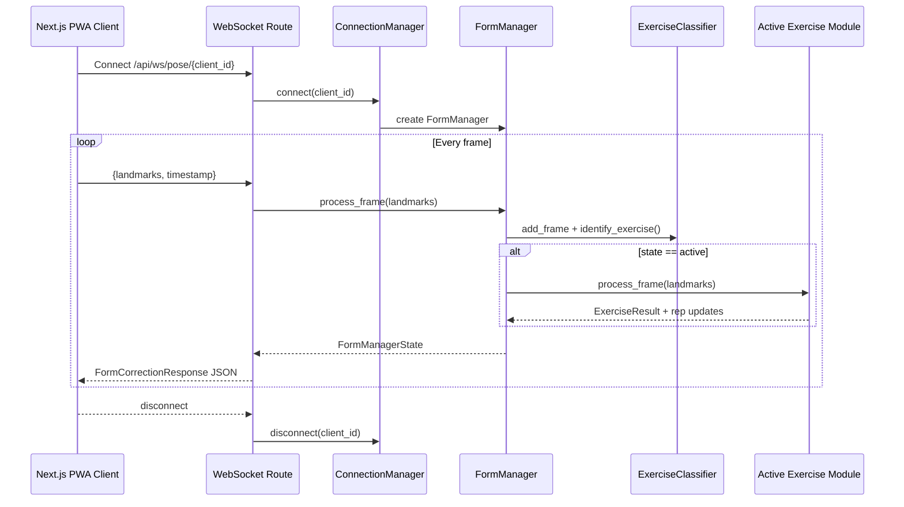
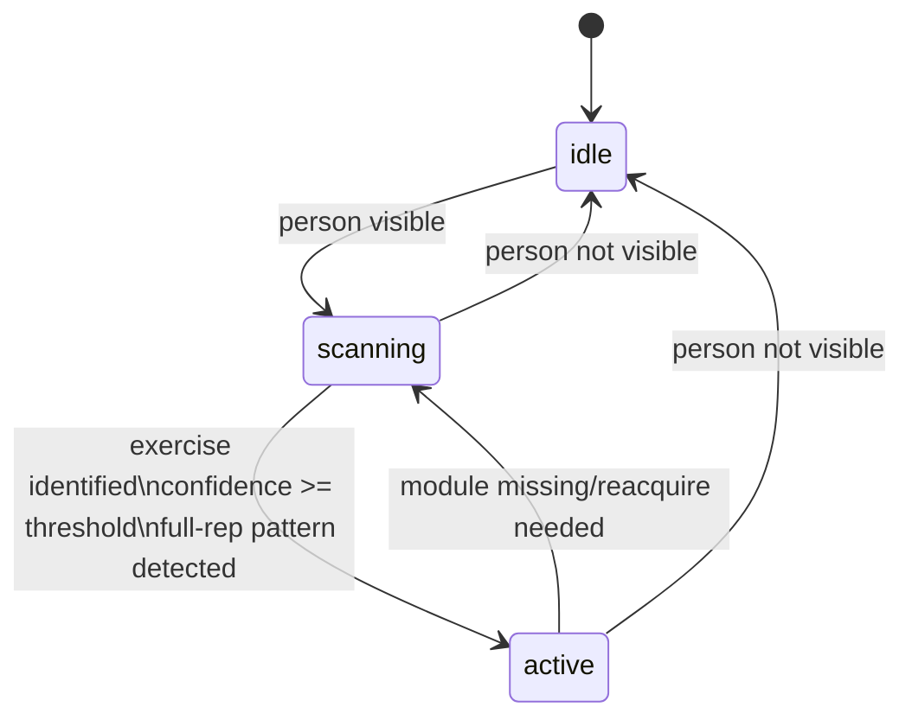

# Backend Architecture

This document explains how the backend works end to end, what components it uses, and how data moves through the system.

## 1) High-Level Architecture

```mermaid
flowchart LR
    Client[External Next.js PWA Client\nSends 33 landmarks per frame] -->|WebSocket JSON| WS[/api/ws/pose/{client_id}\nbackend/api/routes.py/]

    WS --> CM[ConnectionManager\nper-client WebSocket + FormManager]
    CM --> FM[FormManager\nbackend/state_machine/manager.py]

    FM -->|add_frame| CLF[ExerciseClassifier\nbackend/exercises/classifier.py]
    CLF --> SMOOTH[Landmark + Angle Smoothing\nbackend/utils/smoothing.py]

    FM -->|active state| MOD[Active Exercise Module\nSquat/Pushup/Bicep Curl]
    MOD --> REP[HysteresisRepCounter\nbackend/utils/rep_counter.py]

    CLF --> STATE[System State\nidle/scanning/active]
    MOD --> RESULT[ExerciseResult\nviolations/corrections/colors]
    REP --> RESULT

    STATE --> RESP[FormCorrectionResponse]
    RESULT --> RESP
    RESP -->|send_json| Client

    U1[HTTP Upload APIs\nbackend/api/upload.py] --> UPDIR[(uploads/ + chunks/)]
    APIROOT[FastAPI App\nbackend/main.py] --> WS
    APIROOT --> U1
    SETTINGS[Settings + Env\nbackend/config/settings.py] --> APIROOT
    SETTINGS --> FM
    SETTINGS --> CLF
```

## 2) Real-Time Processing Sequence



## 3) State Machine Logic



## 4) What The Backend Uses

- FastAPI: HTTP + WebSocket server, routing, request/response models.
- Pydantic/Pydantic Settings: request schema validation and environment-driven config.
- NumPy: angle and vector math for pose analysis.
- aiofiles: async chunked upload read/write.
- Uvicorn: ASGI runtime.
- Optional Supabase client abstraction for persistence (currently switchable via settings).

## 5) Core Backend Responsibilities

- Accept and manage realtime WebSocket connections per client.
- Run a state machine that controls detection lifecycle (idle -> scanning -> active).
- Classify current exercise from motion history and smoothed landmarks.
- Run exercise-specific form checks and rep counting.
- Return actionable corrections and joint highlights on every frame.
- Support chunked file upload lifecycle: init -> chunk -> status -> complete/cancel.

## 6) How A Frame Becomes Feedback

1. Client sends one frame with 33 pose landmarks and a timestamp.
2. WebSocket route fetches the client's FormManager instance.
3. FormManager checks person visibility and updates system state.
4. ExerciseClassifier smooths landmarks, updates motion buffer, and estimates exercise + confidence.
5. If active, the selected exercise module calculates angles and validates form.
6. HysteresisRepCounter updates phase and rep count with anti-flicker thresholds.
7. Backend builds a FormCorrectionResponse payload.
8. Payload is sent back to client in the same WebSocket loop.

## 7) Main Files and Why They Matter

- backend/main.py: App wiring, middleware, routers, static upload mount.
- backend/config/settings.py: Runtime configuration, thresholds, CORS, feature switches.
- backend/api/routes.py: Realtime WebSocket contract and response assembly.
- backend/state_machine/manager.py: State transitions and exercise-module orchestration.
- backend/exercises/classifier.py: Motion-based exercise identification.
- backend/exercises/base.py: Exercise plugin contract and shared angle helpers.
- backend/exercises/squat.py: Example concrete exercise implementation.
- backend/utils/smoothing.py: Landmark and angle stabilization.
- backend/utils/rep_counter.py: Hysteresis-based phase and rep counting.
- backend/api/upload.py: Chunked upload API and assembly pipeline.
- backend/database/client.py: Mock/Supabase database abstraction.

## 8) Design Properties

- Low-latency feedback via persistent WebSocket loop.
- Per-client isolation through one FormManager per connection.
- Pluggable exercise modules through a shared base contract.
- Noise resistance from smoothing + hysteresis.
- Configurable behavior via environment settings.
